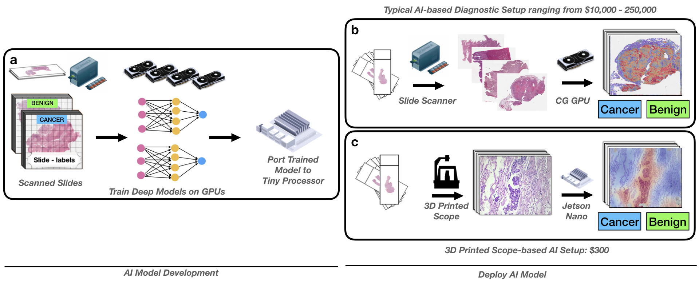

# Embedded AI Scope

*A 3D printed embedded AI-based microscope for pathology diagnosis.*

© This code is made available for non-commercial academic purposes.

*TL;DR: We present a 3D printed microscope coupled with a tiny embedded AI processor for running deep models trained on whole slide images. Tested on lung cancer and head and neck cancer detection and subtyping for both FFPE slides and frozen sections. The proposed setup can be used in low resouce settings where expensive slide scanners, computing equipment and pathology expertise may not be available. The setup can also be used for immidiate diagnosis from frozen sections during surgery.*

### Requirements

The setup of this device requires two small single-board computers (ideally one of which should be specialized for deep learning, such as an Nvidia Jetson Nano). 
Current STLs support an Nvidia Jetson Nano for model inference and a Raspberry Pi for imaging processing. A Raspberry Pi Camera V2 is used for imaging of samples. The STLs support a battery pack at most as large as the Jetson Nano and a 7 inch touch screen, though the specific dimensions of the variable STLs could be changed to accommodate for different setups (for example a larger screen, larger battery packs, or more than one battery pack). 

### Instructions

STL files for 3D printing are in `/stls`. The prints have been tested using a stereolithography (SLA) 3D printer. It is important to note that the battery pack(s) and screen are not specific to the design, as a wide variety of models and parts would provide the necessary functionality. Consequently, the 3D printed parts that house these components would need to be variable and easily modified to fit specific parts, so we include the scripts that generate these parts for customization. See [here](stls/housing_scripts/modifying_housing_stls.md) for details on modifying these STLs.

To build the device,

* Please see [here](stls/assembly_instructions.pdf) for a list of parts and specific assembly instructions with pictures. 
* Also see [assembly video](https://drive.google.com/file/d/1WPFa4IFCZg4AjeARS-ab-TACosYXbkmb/view?usp=sharing) for a very general overview and timelapse of assembly. 
* Ethernet file transfer (if needed) between the Jetson Nano and the Raspberry Pi can be set up in many ways. See [here](stls/ethernet_instructions.md): for details.
* After assembling and setting up the Ethernet connection (if needed), please see [model instructions](docs/README.md) for installing requirements and a toy example.

High-level overview of device structure and setup:

Comparison with traditional development and deployment setups:

